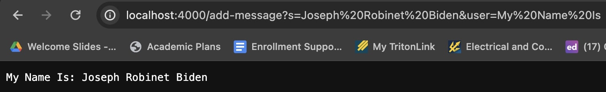

# Introduction
Hello, I'm Nathaniel Petersen, PID A17832207, and this page will explore the webserver "ChatServer", SSH keys and some personal insights I've gained from the week 2 and 3 CSE15L labs.

# Part 1 - ChatServer
## Code for ChatServer

Server.java - Direct copy of Server.java from [Link](https://github.com/ucsd-cse15l-s24/wavelet) repo
```
// A simple web server using Java's built-in HttpServer

// Examples from https://dzone.com/articles/simple-http-server-in-java were useful references

import java.io.IOException;
import java.io.OutputStream;
import java.net.InetSocketAddress;
import java.net.URI;

import com.sun.net.httpserver.HttpExchange;
import com.sun.net.httpserver.HttpHandler;
import com.sun.net.httpserver.HttpServer;

interface URLHandler {
    String handleRequest(URI url);
}

class ServerHttpHandler implements HttpHandler {
    URLHandler handler;
    ServerHttpHandler(URLHandler handler) {
      this.handler = handler;
    }
    public void handle(final HttpExchange exchange) throws IOException {
        // form return body after being handled by program
        try {
            String ret = handler.handleRequest(exchange.getRequestURI());
            // form the return string and write it on the browser
            exchange.sendResponseHeaders(200, ret.getBytes().length);
            OutputStream os = exchange.getResponseBody();
            os.write(ret.getBytes());
            os.close();
        } catch(Exception e) {
            String response = e.toString();
            exchange.sendResponseHeaders(500, response.getBytes().length);
            OutputStream os = exchange.getResponseBody();
            os.write(response.getBytes());
            os.close();
        }
    }
}

public class Server {
    public static void start(int port, URLHandler handler) throws IOException {
        HttpServer server = HttpServer.create(new InetSocketAddress(port), 0);

        //create request entrypoint
        server.createContext("/", new ServerHttpHandler(handler));

        //start the server
        server.start();
        System.out.println("Server Started! If on your local computer, visit http://localhost:" + port + " to visit.");
    }
}
```

ChatServer.java - Modified version of NumberServer from [Link](https://github.com/ucsd-cse15l-s24/wavelet) repo
```
import java.io.IOException;
import java.net.URI;

class Handler implements URLHandler {
    
    String messages = "";

    public String handleRequest(URI url) {
        if (url.getPath().equals("/")) {
            return messages;
        }
        else if(url.getPath().equals("/remove")){
            messages = "";
            return "Messages deleted";
        } 
        else {
            if (url.getPath().contains("/add-message")) {
                String[] parameters = url.getQuery().split("&");

                if (parameters.length!=2){
                    return "404 Not Found";
                }

                String[] message = parameters[0].split("=");

                String[] user = parameters[1].split("=");

                if((message[0].equals("s") && user[0].equals("user")) != true){
                    return "Please give message requests in the format of /add-message?s=<your message>&user=<your name>";
                }

                messages += user[1] + ": " + message[1] + "\n";
                return messages;
            }
            return "404 Not Found!";
        }
    }
}

class ChatServer {
    public static void main(String[] args) throws IOException {
        if(args.length == 0){
            System.out.println("Missing port number! Try any number between 1024 to 49151");
            return;
        }

        int port = Integer.parseInt(args[0]);

        Server.start(port, new Handler());
    }
}
```




